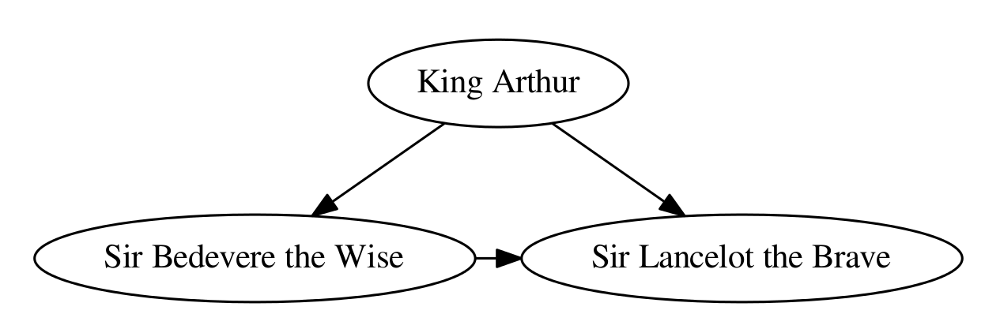

# Graphviz4S

This project is a simply implementation of the python [Graphviz](https://github.com/xflr6/graphviz) library functionality in Scala.


It tries to keep the interface the same with the python [Graphviz](https://github.com/xflr6/graphviz) library, which facilitates the creation and rendering of graph descriptions in the [DOT](http://www.graphviz.org/doc/info/lang.html) language of the [Graphviz](http://www.graphviz.org/) graph drawing software([repo](https://github.com/ellson/graphviz/)) from Scala.

##Installation

To render the generated DOT source code, you also need to install [Graphviz](http://www.graphviz.org/Download.php).

Make sure that the directory containing the ``dot`` executable is on your
systems' path.

If you are using ubuntu, use the following command to install graphviz:
```bash
sudo apt-get install graphviz
```

##Build
```bash
bash scripts/build.sh
```

##Run examples
```bash
bash scripts/run_all_examples.sh
```

##Quickstart
###Create a graph object:
```scala
import com.liangdp.graphviz4s.Digraph
val dot = new Digraph(comment = "The Round Table")
```
###Add nodes and edges:
```scala
dot.node("A", "King Arthur")
dot.node("B", "Sir Bedevere the Wise")
dot.node("L", "Sir Lancelot the Brave")

import scala.collection.mutable.Map
dot.edges(Array(("A", "B"), ("A", "L")))
dot.edge("B", "L", attrs = Map("constraint" -> "false"))
```
###Check the generated source code:
```scala
println(dot.source())
// The Round Table
digraph {
	"A" [label="King Arthur" ]
	"B" [label="Sir Bedevere the Wise" ]
	"L" [label="Sir Lancelot the Brave" ]
		A -> B
		A -> L
		B -> L [ constraint=false]
}
```
###Save and render the source code, optionally view the result:
```scala
dot.render(fileName = "round-table.gv", directory = ".", view = true)
```
<div align='left'>
  
</div>

## Support
The following platforms are supported by this package:

OS | Architecture
--- | ---
Linux | x86_64
Linux | x86_32
